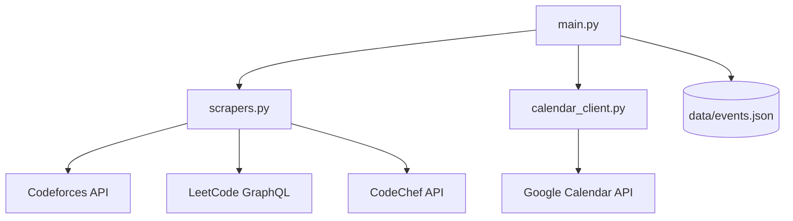

# Contest Calendar Sync

[](https://www.python.org/downloads/)
[](https://developers.google.com/calendar)
[](https://opensource.org/licenses/MIT)

Automatically synchronize upcoming competitive programming contests from **Codeforces**, **LeetCode**, and **CodeChef** directly to your Google Calendar. Never miss a round again!

---

## Features

- **Multi-Platform Support**: Aggregates contests from the most popular CP platforms.
- **Smart Sync**: Automatically updates existing events if their time or duration changes.
- **Color-Coded Events**: Distinct colors for each platform (Blue for CF, Yellow for LC, Red for CC).
- **Custom Reminders**: predefined 10-minute popup reminders for every contest.
- **Cross-Platform Automation**: Ready-to-use scripts for Linux, macOS, and Windows.
- **Detailed Logging**: Every sync action is documented in `sync.log`.

---

## Project Structure



---

## Setup and Installation

### 1. Prerequisities
- Python 3.10 or higher.
- A Google Cloud Project with the **Google Calendar API** enabled.

### 2. Clone and Install
```bash
git clone <your-repo-url>
cd ContestCalendar
pip install -r requirements.txt
```

### 3. Initialize Data Directory
While the script creates these automatically, you can pre-initialize them:
```bash
mkdir -p data
echo "{}" > data/events.json
```

### 4. Google API Credentials
1. Go to the [Google Cloud Console](https://console.cloud.google.com/).
2. Create **OAuth 2.0 Client IDs** (Desktop application).
3. Download the JSON file and save it as `credentials.json` in the project root.

### 5. First Run & Authorization
Run the script manually to perform the initial authentication:
```bash
python main.py
```
This will open your browser. Once authorized, a `token.json` file will be created, allowing for future background syncs without manual intervention.

---

## Automation (Daily Sync)

### Linux and macOS (Cron)
1. Open your crontab: `crontab -e`
2. Add the following line (run daily at 8 AM):
   ```bash
   0 8 * * * /path/to/ContestCalendar/run_sync.sh
   ```

### Windows (Task Scheduler)
1. Open **Task Scheduler** and **Create Basic Task**.
2. Trigger: **Daily**.
3. Action: **Start a program**.
4. Program/script: Browse to `run_sync.bat`.
5. **Start in**: Absolute path to your `ContestCalendar` folder.

---

## Configuration

| Argument | Description | Default |
|----------|-------------|---------|
| `--dry-run` | Log actions without modifying the calendar | `False` |
| `--days` | Number of days to look ahead | `7` |

---

## Maintenance
- **Logs**: check `sync.log` for execution history.
- **Local Cache**: `data/events.json` stores the mapping between Platform IDs and Google Calendar Event IDs. **Do not delete this file** unless you want to re-create all calendar events.

---

## License
Distributed under the MIT License. See `LICENSE` for more information.
